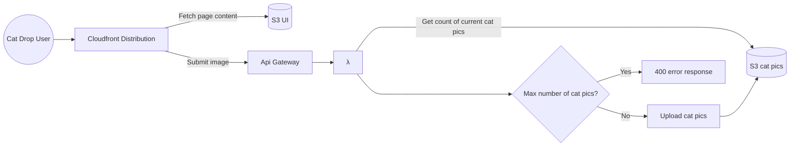

# Cat Drop
## Vision
~~Silly~~ Highly sophisticated site to drop your favorite cat pics.

## Architecture Diagram

## Package Breakdown
### **cdk**
Utilize AWS CDK infrastructure as code to:
* Host single page svelte app via AWS CloudFront distribution and S3.
* Host backend via AWS lambda and API Gateway

### **ui**
Utilize [svelte](https://svelte.dev/docs) to build highly responsive, mobile friendly interface to drop cat pics.

### **service**
Utilize typescript and [express](https://www.npmjs.com/package/express) to host backend. The backend does some basic verification (i.e. submitted image size, and total count of cat pics do not exceed maximums) before saving the image to S3. Needs work!
