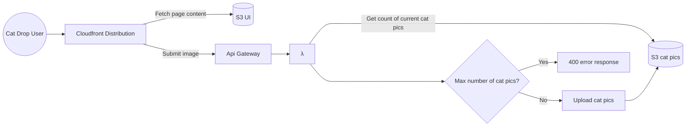

# [Cat Drop](https://d1f75un4ao3enu.cloudfront.net/)
## Vision
~~Silly~~ Highly sophisticated site to drop your favorite cat pics.

## Architecture Diagram

## Package Breakdown
### **cdk**
Utilize AWS CDK infrastructure as code to:
* Host single page svelte app via AWS CloudFront distribution and S3.
* Host backend via AWS lambda and API Gateway

### **ui**
Utilize [svelte](https://svelte.dev/docs) to build highly responsive, mobile friendly interface to drop cat pics.

### **service**
Utilize typescript and [express](https://www.npmjs.com/package/express) to host backend. The backend does some basic verification (i.e. submitted image size, and total count of cat pics do not exceed maximums) before saving the image to S3. Needs work!

## TODO
1. Add eslint and 100% test coverage to `yarn verify` command.
1. Add tab to UI to display cat pics.
1. Implement AWS Web Application Firewall around Cloudfront Distribution and Api Gateway to protect against network level attacks.
1. Add hosted zone and register a domain such as `cat.drop` or `catdrop.com`. 
    * Host the backend on a subdomain such as `api.cat.drop` or `api.catdrop.com`.
    * Host branches on subdomains such as `mybranch.cat.drop` and `mybranch.api.cat.drop` to test branches directly.
1. Publish [`StaticWebHost` construct](./cdk/src/StaticWebHost.ts) to private artifactory for use in other projects.
1. Publish [build and deploy actions](./.github/actions/) to github marketplace for use in other  workflows.